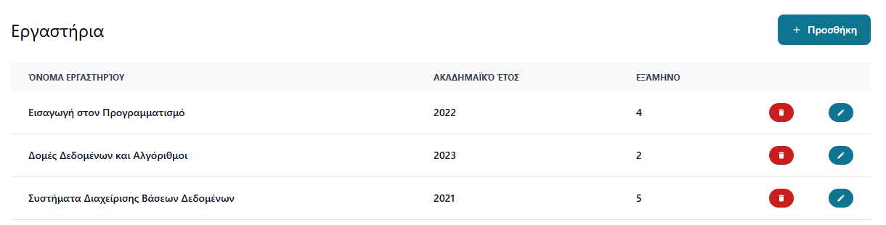

### Λειτουργικές Απαιτήσεις και Υλοποίηση

### Εισαγωγή στις Λειτουργικές Απαιτήσεις

Οι λειτουργικές απαιτήσεις της εφαρμογής διαχείρισης απουσιών καθορίζουν τις βασικές λειτουργίες που πρέπει να παρέχει η εφαρμογή στους χρήστες της. Αυτές οι απαιτήσεις έχουν σχεδιαστεί με γνώμονα την απλοποίηση και αυτοματοποίηση της διαδικασίας παρακολούθησης των απουσιών των φοιτητών στα εργαστηριακά μαθήματα.

### Κύριες Λειτουργικές Απαιτήσεις

#### 1. Διαχείριση Χρηστών

##### 1.1 Εγγραφή και Σύνδεση Χρηστών

Η εφαρμογή πρέπει να επιτρέπει:
- Εγγραφή νέων χρηστών
- Σύνδεση υπαρχόντων χρηστών
- Αποσύνδεση χρηστών

Η υλοποίηση αυτών των λειτουργιών γίνεται μέσω των σελίδων `SignIn.tsx` και `SingUp.tsx`:

```tsx
// Τμήμα από το SignIn.tsx για τη σύνδεση χρηστών
const login = async () => {
  if (!isValid()) return;
  setProcessing(true);
  try {
    const { data } = await api.post<{ token: string }>("api/user/signin", {
      username,
      password,
    });
    localStorage.setItem("token", data.token);
    apiParams.authInterceptorId = api.interceptors.request.use((config) => {
      config.headers.Authorization = `Bearer ${data.token}`;
      return config;
    });
    dispatch({ type: actionsEnum.auth, payload: { auth: true } });
    navigate("/");
  } catch (error) {
    setPassword("");
    dispatch({
      type: actionsEnum.toast,
      payload: {
        show: true,
        message: "Λάθος όνομα χρήστη ή κωδικός πρόσβασης",
        toastType: "error",
      },
    });
  }
  setProcessing(false);
};
```

##### 1.2 Διαχείριση Ρόλων

Η εφαρμογή υποστηρίζει διαφορετικούς ρόλους χρηστών:
- Administrator (διαχειριστής)
- Teacher (καθηγητής)

Κάθε ρόλος έχει διαφορετικά δικαιώματα και δυνατότητες στην εφαρμογή.

```tsx
// Από το appReducer.ts, ορισμός των ρόλων
export enum Roles {
  admin = "admin",
  teacher = "teacher",
}
```

#### 2. Διαχείριση Εργαστηρίων

##### 2.1 Δημιουργία, Επεξεργασία και Διαγραφή Εργαστηρίων

Η εφαρμογή επιτρέπει στους καθηγητές να:
- Δημιουργούν νέα εργαστήρια
- Επεξεργάζονται υπάρχοντα εργαστήρια
- Διαγράφουν εργαστήρια

Αυτές οι λειτουργίες υλοποιούνται στο αρχείο `Labs.tsx`:

```tsx
// Δημιουργία νέου εργαστηρίου
const sendNew = async () => {
  if (!checkValidation()) return;
  setIsProcessing(true);
  await api.post<Lab>(`api/labs`, selectedLab.current);
  setIsProcessing(false);
  closeModal();
  getData();
};

// Επεξεργασία υπάρχοντος εργαστηρίου
const sendEdit = async () => {
  if (!checkValidation()) return;
  setIsProcessing(true);
  await api.put<Lab>(
    `api/labs/${selectedLab.current.id}`,
    selectedLab.current
  );
  setIsProcessing(false);
  closeModal();
  getData();
};

// Διαγραφή εργαστηρίου
const sendDelete = async (id: number) => {
  await api.delete<Lab>(`api/labs/${id}`);
  getData();
};
```

##### 2.2 Προβολή Λίστας Εργαστηρίων

Οι χρήστες μπορούν να δουν μια λίστα με όλα τα διαθέσιμα εργαστήρια, με πληροφορίες όπως:
- Όνομα εργαστηρίου
- Ακαδημαϊκό έτος
- Εξάμηνο



#### 3. Προγραμματισμός Εργαστηριακών Συνεδριών

##### 3.1 Δημιουργία και Διαχείριση Συνεδριών

Οι καθηγητές μπορούν να:
- Δημιουργούν νέες εργαστηριακές συνεδρίες
- Καθορίζουν την ημερομηνία, την ώρα έναρξης και λήξης
- Ορίζουν την επανάληψη των συνεδριών (εβδομαδιαία, κλπ.)

Αυτές οι λειτουργίες υλοποιούνται στο component `Calendar.tsx`:

```tsx
// Δημιουργία νέας συνεδρίας
const sendNew = async () => {
  setIsProcessing(true);
  await api.post("api/labinstance", form);
  refresh().then(() => {
    closeModal();
  });
  setIsProcessing(false);
};

// Επεξεργασία υπάρχουσας συνεδρίας
const sendEdit = async () => {
  setIsProcessing(true);
  await api.put(`api/labinstance/${form.id}`, form);
  refresh().then(() => {
    closeModal();
  });
  setIsProcessing(false);
};
```

##### 3.2 Προβολή Ημερολογίου

Η εφαρμογή παρέχει ένα διαδραστικό ημερολόγιο για την προβολή των προγραμματισμένων συνεδριών:

```tsx
<FullCalendar
  plugins={[dayGridPlugin, timeGridPlugin, interactionPlugin]}
  initialView="timeGridWeek"
  weekends={weekends.weekendsVisible}
  editable={true}
  selectable={true}
  selectMirror={true}
  dayMaxEvents={true}
  height="auto"
  events={events}
  eventClick={eventClick}
  eventChange={eventChanged}
  headerToolbar={{
    left: "prev,next today",
    center: "title",
    right: "dayGridMonth,timeGridWeek,timeGridDay",
  }}
  locale={"el"}
  allDaySlot={false}
  slotMinTime={"08:00:00"}
  slotMaxTime={"23:00:00"}
  firstDay={1}
/>
```

#### 4. Διαχείριση Φοιτητών

##### 4.1 Προσθήκη και Διαχείριση Φοιτητών

Οι καθηγητές μπορούν να:
- Προσθέτουν νέους φοιτητές
- Επεξεργάζονται πληροφορίες φοιτητών
- Διαγράφουν φοιτητές

Αυτές οι λειτουργίες υλοποιούνται στο αρχείο `Students.tsx`.

##### 4.2 Καταγραφή Παρουσιών/Απουσιών

Οι καθηγητές μπορούν να:
- Καταγράφουν τις παρουσίες και απουσίες των φοιτητών
- Προβάλλουν το ιστορικό παρουσιών/απουσιών

Αυτές οι λειτουργίες υλοποιούνται στο αρχείο `Absences.tsx` και `Absences.modal.tsx`:

```tsx
// Από το Absences.tsx, διαγραφή εγγραφής
const sendDelete = async (sub: Subscription) => {
  await api.delete(`api/subscriptions/${id}`, {
    data: {
      labInstanceId: id,
      studentId: sub.id,
      subscriptionDate: sub.subscriptionDate,
    },
  });
  refresh();
};
```

##### 4.3 Αναζήτηση Φοιτητών

Η εφαρμογή παρέχει λειτουργίες αναζήτησης για τους φοιτητές:

```tsx
// Από το Absences.tsx, αναζήτηση φοιτητών
const searchedSubs = useMemo(() => {
  const numSerch = parseInt(search);
  let key: "name" | "register_number" = "register_number";
  if (isNaN(numSerch)) {
    key = "name";
  }

  return currentSubs.filter((s) => {
    let searchStr = s[key];
    if (typeof searchStr !== "string") {
      searchStr = `${searchStr}`;
    } else {
      searchStr = greelUtils.toGreeklish(searchStr.toLowerCase());
    }

    return searchStr.includes(search);
  });
}, [currentSubs, search]);
```

#### 5. Διαχείριση Καθηγητών

##### 5.1 Προσθήκη και Διαχείριση Καθηγητών (Admin)

Οι διαχειριστές μπορούν να:
- Προσθέτουν νέους καθηγητές
- Επεξεργάζονται πληροφορίες καθηγητών
- Διαγράφουν καθηγητές

Αυτές οι λειτουργίες υλοποιούνται στο αρχείο `Teachers.tsx`.

#### 6. Ειδοποιήσεις και Ανατροφοδότηση Χρήστη (User Feedback)

Η εφαρμογή παρέχει ένα σύστημα ειδοποιήσεων για να ενημερώνει τους χρήστες για διάφορες ενέργειες και γεγονότα:


### Περιορισμοί και Επικύρωση Δεδομένων

Η εφαρμογή περιλαμβάνει διάφορους ελέγχους και περιορισμούς για να διασφαλίσει την ακεραιότητα των δεδομένων:

```tsx
// Από το Labs.tsx, έλεγχος εγκυρότητας δεδομένων
const checkValidation = () => {
  const nameLength = selectedLab.current.lab_name.length;
  if (nameLength > 0) {
    return true;
  } else {
    setIsValid(false);
    return false;
  }
};
```

### Πρωτόκολλα Επικοινωνίας με το Backend

Η επικοινωνία με το backend γίνεται μέσω του Axios, με τη χρήση RESTful API:

```tsx
// Από το api.ts, δημιουργία του Axios instance
const api = axios.create({
  baseURL: process.env.REACT_APP_API_URL || "http://localhost:3000/",
  timeout: 10000,
  withCredentials: false,
});

// Προσθήκη του token πιστοποίησης σε κάθε αίτηση
(function addAuthInterceptor() {
  const token = localStorage.getItem("token");
  if (token) {
    apiParams.authInterceptorId = api.interceptors.request.use((config) => {
      config.headers.Authorization = `Bearer ${token}`;
      return config;
    });
  }
})();
```

### Συμπεράσματα

Οι λειτουργικές απαιτήσεις της εφαρμογής διαχείρισης απουσιών καλύπτουν όλες τις βασικές ανάγκες για την αποτελεσματική παρακολούθηση της συμμετοχής των φοιτητών στα εργαστηριακά μαθήματα. Η υλοποίηση αυτών των απαιτήσεων έχει γίνει με σύγχρονες τεχνολογίες και πρακτικές, εξασφαλίζοντας μια αποδοτική και εύχρηστη εφαρμογή.

Κάθε λειτουργική απαίτηση έχει υλοποιηθεί με τρόπο που επιτρέπει την εύκολη συντήρηση και επέκταση, ακολουθώντας τις βέλτιστες πρακτικές ανάπτυξης λογισμικού. Η διεπαφή χρήστη έχει σχεδιαστεί για να είναι διαισθητική και εύχρηστη, ενώ το backend παρέχει τις απαραίτητες λειτουργίες για την αποθήκευση και ανάκτηση των δεδομένων.