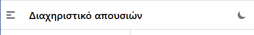
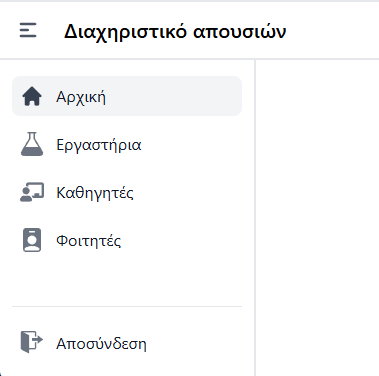
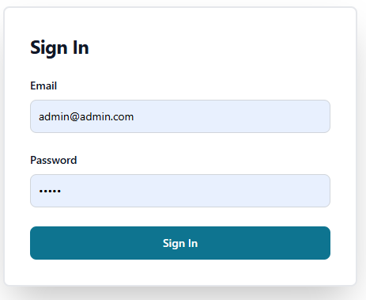
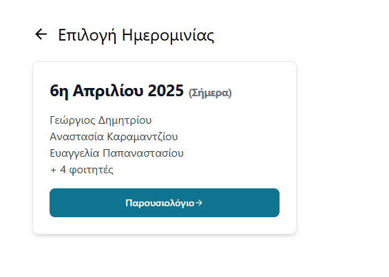
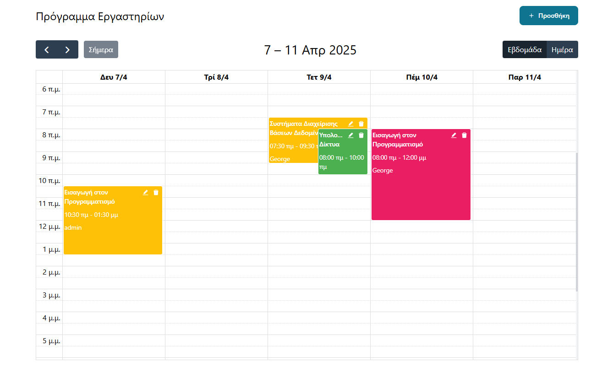
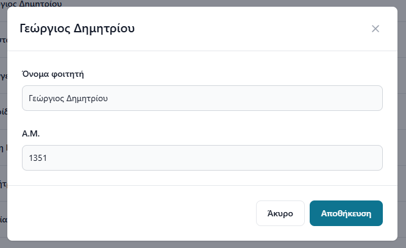
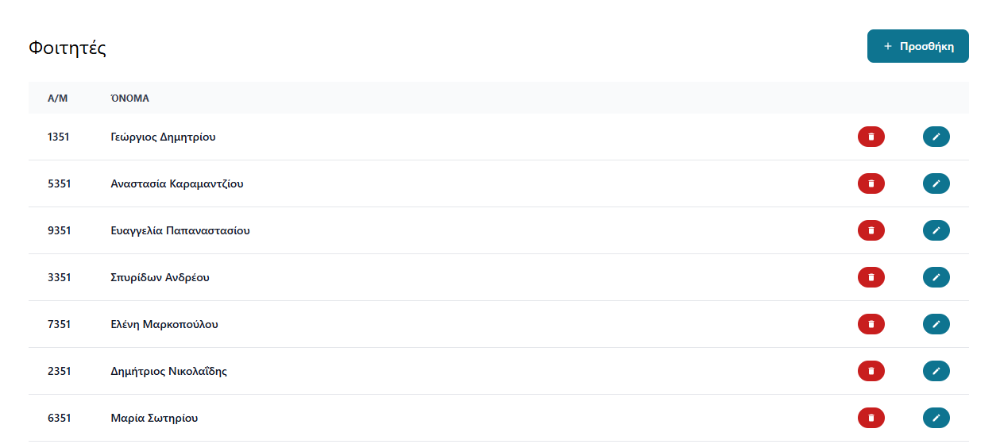
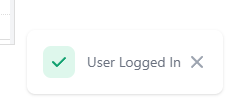
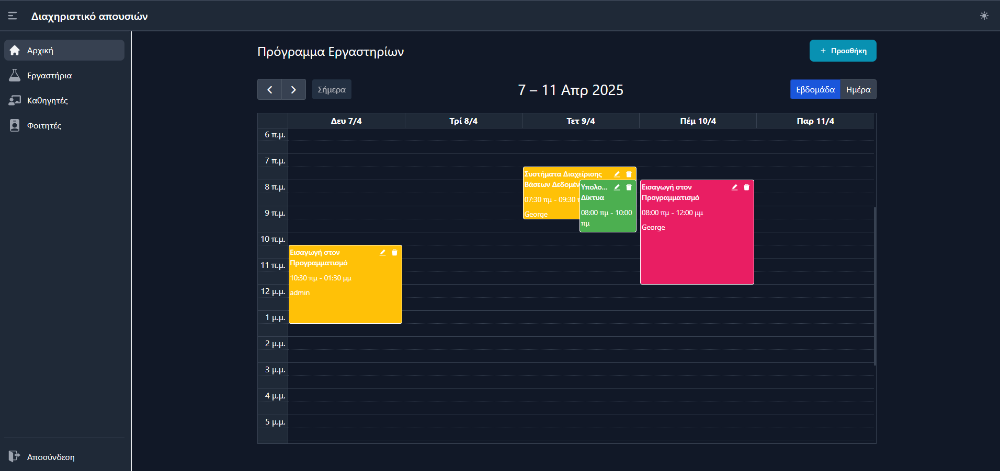

## Διεπαφή Χρήστη (User Interface)

### Εισαγωγή

Η διεπαφή χρήστη της εφαρμογής διαχείρισης απουσιών έχει σχεδιαστεί με βασικούς στόχους την απλότητα, τη λειτουργικότητα και την καλαίσθητη εμφάνιση. Η υλοποίηση βασίζεται σε σύγχρονες τεχνολογίες και πρακτικές σχεδιασμού διεπαφών, με έμφαση στην εύκολη πλοήγηση και την αποτελεσματική εκτέλεση των διαφόρων λειτουργιών της εφαρμογής.

### Βασική Δομή της Διεπαφής

Η βασική δομή της διεπαφής χρήστη αποτελείται από τα εξής κύρια στοιχεία:

#### 1. Μπάρα Πλοήγησης (Navbar)

Η μπάρα πλοήγησης βρίσκεται στο πάνω μέρος της εφαρμογής και περιλαμβάνει:
- Το λογότυπο/τίτλο της εφαρμογής
- Κουμπί για την εναλλαγή του πλαϊνού μενού (sidebar)
- Κουμπί για την εναλλαγή μεταξύ σκοτεινού και φωτεινού θέματος (dark/light mode)



Η μπάρα πλοήγησης έχει σχεδιαστεί με μια καθαρή και λιτή προσέγγιση. Στην αριστερή πλευρά, υπάρχει ένα εικονίδιο μενού (hamburger icon) που επιτρέπει στους χρήστες να αναδιπλώνουν ή να εκτείνουν το πλαϊνό μενού, προσφέροντας έτσι περισσότερο χώρο για το κύριο περιεχόμενο όταν χρειάζεται. Δίπλα στο εικονίδιο μενού βρίσκεται ο τίτλος της εφαρμογής "Διαχειριστικό απουσιών" με έντονη γραμματοσειρά, που λειτουργεί ως οπτικό αγκυροβόλιο για τον χρήστη.

Στη δεξιά πλευρά της μπάρας πλοήγησης, υπάρχει ένα κουμπί εναλλαγής για την εναλλαγή μεταξύ φωτεινού και σκοτεινού θέματος, προσφέροντας προσαρμογή της οπτικής εμπειρίας ανάλογα με τις προτιμήσεις του χρήστη ή τις συνθήκες φωτισμού περιβάλλοντος.

Η μπάρα πλοήγησης προσαρμόζεται στο πλάτος της οθόνης και διατηρεί τη συνοχή της σε διάφορα μεγέθη οθόνης, με τα στοιχεία της να αναδιατάσσονται ανάλογα για βέλτιστη εμφάνιση και χρηστικότητα.

#### 2. Πλαϊνό Μενού (Sidebar)

Το πλαϊνό μενού παρέχει πρόσβαση στις κύριες λειτουργίες της εφαρμογής και μπορεί να αναδιπλωθεί για να παρέχει περισσότερο χώρο στο κύριο περιεχόμενο. Το μενού περιλαμβάνει:
- Συνδέσμους προς τις κύριες σελίδες της εφαρμογής
- Εικονίδια για οπτική αναγνώριση
- Επιλογές που προσαρμόζονται ανάλογα με το ρόλο του χρήστη



Το πλαϊνό μενού είναι οργανωμένο σε δύο κύριες ομάδες στοιχείων. Η πρώτη ομάδα, που καταλαμβάνει το μεγαλύτερο μέρος του μενού, περιέχει τις κύριες επιλογές πλοήγησης της εφαρμογής. Κάθε επιλογή συνοδεύεται από ένα χαρακτηριστικό εικονίδιο και έναν τίτλο, διευκολύνοντας την αναγνώριση και την πλοήγηση.

Στο κάτω μέρος του πλαϊνού μενού βρίσκεται η δεύτερη ομάδα στοιχείων, που περιλαμβάνει την επιλογή αποσύνδεσης (όταν ο χρήστης είναι συνδεδεμένος) και άλλες βοηθητικές λειτουργίες. Ο διαχωρισμός αυτός βοηθά στην οργάνωση του μενού με βάση τη συχνότητα και τη σημασία των λειτουργιών.

Το πλαϊνό μενού έχει διαχωριστικό περίγραμμα στη δεξιά πλευρά, διαχωρίζοντάς το οπτικά από την κύρια περιοχή περιεχομένου. Όταν ο χρήστης επιλέγει μια σελίδα, η αντίστοιχη επιλογή στο μενού επισημαίνεται, παρέχοντας οπτική ένδειξη της τρέχουσας θέσης στην εφαρμογή.

Επιπλέον, το πλαϊνό μενού είναι σχεδιασμένο να προσαρμόζεται σε διαφορετικά μεγέθη οθόνης, με δυνατότητα αναδίπλωσης (collapsing) για εξοικονόμηση χώρου σε μικρότερες οθόνες ή όταν ο χρήστης χρειάζεται περισσότερο χώρο για εργασία.


#### 3. Κύρια Περιοχή Περιεχομένου

Η κύρια περιοχή περιεχομένου εμφανίζει τη σελίδα που έχει επιλέξει ο χρήστης και είναι το κύριο σημείο αλληλεπίδρασης με την εφαρμογή.

Η κύρια περιοχή περιεχομένου καταλαμβάνει το μεγαλύτερο μέρος της διεπαφής και προσαρμόζεται ανάλογα με το περιεχόμενο που εμφανίζεται. Έχει σχεδιαστεί με λευκό φόντο στο φωτεινό θέμα και σκούρο γκρίζο φόντο στο σκοτεινό θέμα, προσφέροντας άνετη ανάγνωση και αλληλεπίδραση.

Η περιοχή αυτή διαθέτει λειτουργία κύλισης (scrolling) για την προβολή περιεχομένου που υπερβαίνει το ορατό μέγεθος της οθόνης, διατηρώντας τη μπάρα πλοήγησης και το πλαϊνό μενού σταθερά.

Κατά τη φόρτωση περιεχομένου, εμφανίζεται ένας δείκτης φόρτωσης (spinner) στο κέντρο της οθόνης, παρέχοντας οπτική ανατροφοδότηση στον χρήστη ότι η εφαρμογή επεξεργάζεται το αίτημά του.

Η δυναμική φόρτωση περιεχομένου υλοποιείται με τη χρήση του React Router, που επιτρέπει την εναλλαγή μεταξύ διαφορετικών σελίδων χωρίς την ανανέωση ολόκληρης της εφαρμογής, προσφέροντας μια πιο άμεση και ομαλή εμπειρία πλοήγησης.

Στο κάτω δεξιά μέρος της περιοχής περιεχομένου εμφανίζονται οι ειδοποιήσεις (toast notifications), παρέχοντας σύντομη ανατροφοδότηση για επιτυχημένες ή αποτυχημένες ενέργειες του χρήστη. Αυτές οι ειδοποιήσεις εμφανίζονται προσωρινά και μπορούν να κλείσουν αυτόματα ή με επιλογή του χρήστη.

### Κύριες Σελίδες της Εφαρμογής

#### 1. Σελίδα Σύνδεσης (SignIn)

Η σελίδα σύνδεσης επιτρέπει στους χρήστες να συνδεθούν στην εφαρμογή χρησιμοποιώντας το όνομα χρήστη και τον κωδικό πρόσβασής τους.

Η σελίδα σύνδεσης παρουσιάζει μια απλή και καθαρή φόρμα εισόδου, τοποθετημένη κεντρικά στην οθόνη για εύκολη πρόσβαση. Η φόρμα αποτελείται από δύο κύρια πεδία εισαγωγής: ένα για το όνομα χρήστη και ένα για τον κωδικό πρόσβασης.

Κάθε πεδίο εισαγωγής συνοδεύεται από μια ετικέτα που περιγράφει τον σκοπό του (π.χ. "Όνομα Χρήστη" και "Κωδικός"), καθώς και από ένα placeholder που παρέχει επιπλέον καθοδήγηση στον χρήστη. Το πεδίο του κωδικού πρόσβασης είναι τύπου "password", κρύβοντας τον κωδικό για λόγους ασφαλείας κατά την εισαγωγή.

Στο κάτω μέρος της φόρμας, υπάρχει ένα κουμπί "Σύνδεση" που υποβάλλει τη φόρμα. Το κουμπί αυτό εμφανίζει ένα δείκτη φόρτωσης όταν η διαδικασία σύνδεσης είναι σε εξέλιξη και απενεργοποιείται για να αποτρέψει πολλαπλές υποβολές. Αυτή η οπτική ανατροφοδότηση ενημερώνει τον χρήστη ότι το αίτημα σύνδεσης βρίσκεται σε επεξεργασία.

Η φόρμα χρησιμοποιεί τεχνικές επικύρωσης για να διασφαλίσει ότι όλα τα απαιτούμενα πεδία συμπληρώνονται πριν από την υποβολή. Αν ο χρήστης προσπαθήσει να υποβάλει τη φόρμα χωρίς να συμπληρώσει όλα τα απαιτούμενα πεδία, εμφανίζονται κατάλληλα μηνύματα σφάλματος που καθοδηγούν τον χρήστη για τη σωστή συμπλήρωση.

Ο σχεδιασμός της σελίδας σύνδεσης είναι λιτός και εστιασμένος, χωρίς περιττά στοιχεία που θα μπορούσαν να αποσπάσουν την προσοχή του χρήστη από τον κύριο στόχο: την είσοδο στην εφαρμογή.



#### 2. Σελίδα Εργαστηρίων (Labs)

Η σελίδα εργαστηρίων επιτρέπει στους καθηγητές να διαχειρίζονται τα εργαστήρια που προσφέρονται.

Η σελίδα εργαστηρίων παρουσιάζει έναν συνολικό πίνακα των διαθέσιμων εργαστηρίων, προσφέροντας μια εποπτική εικόνα της προσφερόμενης εκπαιδευτικής ύλης. Στο πάνω μέρος της σελίδας, υπάρχει μια επικεφαλίδα με τον τίτλο "Εργαστήρια" και ένα κουμπί "Προσθήκη" με ένα εικονίδιο συν (+), επιτρέποντας στους καθηγητές να προσθέσουν νέα εργαστήρια στο σύστημα.

Ο κύριος πίνακας εργαστηρίων διαθέτει στήλες για τις βασικές πληροφορίες κάθε εργαστηρίου, συμπεριλαμβανομένων του ονόματος του εργαστηρίου, του ακαδημαϊκού έτους και του εξαμήνου. Επιπλέον, υπάρχουν δύο στήλες ενεργειών με κουμπιά για τη διαγραφή και την επεξεργασία κάθε εργαστηρίου.

Τα κουμπιά διαγραφής εμφανίζονται με κόκκινο χρώμα και ένα εικονίδιο διαγραφής, υποδηλώνοντας την καταστροφική φύση της ενέργειας. Τα κουμπιά επεξεργασίας, από την άλλη πλευρά, έχουν ένα εικονίδιο επεξεργασίας και επιτρέπουν στους καθηγητές να τροποποιούν τις πληροφορίες των υπαρχόντων εργαστηρίων.

Ο πίνακας έχει σχεδιαστεί με εναλλασσόμενα χρώματα γραμμών για καλύτερη αναγνωσιμότητα και διαθέτει λειτουργία hover, που αλλάζει το χρώμα φόντου όταν ο δείκτης του ποντικιού βρίσκεται πάνω από μια γραμμή, ενισχύοντας την αλληλεπίδραση με τον χρήστη.

Κατά τη φόρτωση των δεδομένων του πίνακα, εμφανίζεται ένας δείκτης φόρτωσης (spinner) στο κέντρο, παρέχοντας οπτική ανατροφοδότηση στον χρήστη ότι τα δεδομένα ανακτώνται από τον διακομιστή.

Ο σχεδιασμός της σελίδας είναι απλός και λειτουργικός, εστιάζοντας στην αποτελεσματική παρουσίαση και διαχείριση των πληροφοριών των εργαστηρίων.

#### 3. Σελίδα Απουσιών (Absences)

Η σελίδα απουσιών επιτρέπει στους καθηγητές να διαχειρίζονται τις παρουσίες και τις απουσίες των φοιτητών.



Η σελίδα απουσιών προσφέρει ένα ολοκληρωμένο περιβάλλον για την παρακολούθηση της παρουσίας φοιτητών σε συγκεκριμένες ημερομηνίες εργαστηρίων. Όταν επιλεγεί μια ημερομηνία, η διεπαφή προσαρμόζεται για να εμφανίσει τις λεπτομέρειες για τη συγκεκριμένη ημέρα.

Στο πάνω μέρος της σελίδας εμφανίζεται η επιλεγμένη ημερομηνία σε μορφή "DD MMMM YYYY", προσφέροντας σαφή χρονική αναφορά. Δίπλα στην ημερομηνία υπάρχει ένα εικονίδιο επιστροφής που επιτρέπει στον χρήστη να επιστρέψει στην προβολή του ημερολογίου. Στη δεξιά πλευρά, υπάρχει ένα κουμπί "Εγγραφή φοιτητών" που επιτρέπει την προσθήκη νέων φοιτητών στο παρουσιολόγιο της συγκεκριμένης ημέρας.

Κάτω από την επικεφαλίδα, υπάρχει ένα πεδίο αναζήτησης που επιτρέπει στους καθηγητές να φιλτράρουν γρήγορα τη λίστα των φοιτητών, διευκολύνοντας την εύρεση συγκεκριμένων εγγραφών σε μεγάλες λίστες. Το πεδίο αναζήτησης συνοδεύεται από ένα εικονίδιο αναζήτησης για οπτική αναγνώριση.

Ο κύριος πίνακας παρουσιολογίου εμφανίζει τους εγγεγραμμένους φοιτητές, παρουσιάζοντας τον αριθμό μητρώου και το όνομα κάθε φοιτητή. Κάθε εγγραφή συνοδεύεται από ένα κουμπί διαγραφής, που επιτρέπει την αφαίρεση του φοιτητή από το παρουσιολόγιο της συγκεκριμένης ημέρας.

Ο πίνακας έχει σχεδιαστεί με εναλλασσόμενα χρώματα γραμμών για καλύτερη αναγνωσιμότητα και διαθέτει λειτουργία hover, παρόμοια με τον πίνακα εργαστηρίων.

Σε περίπτωση που δεν υπάρχουν εγγεγραμμένοι φοιτητές για τη συγκεκριμένη ημερομηνία, εμφανίζεται ένα ενημερωτικό μήνυμα "Κανένας εγγεγραμμένος φοιτητής", καθοδηγώντας τον χρήστη για την κατάσταση του παρουσιολογίου.

Η σελίδα απουσιών συνδυάζει την αποτελεσματική οργάνωση πληροφοριών με εύχρηστα στοιχεία ελέγχου, προσφέροντας μια ολοκληρωμένη λύση για την παρακολούθηση της παρουσίας φοιτητών στα εργαστηριακά μαθήματα.

#### 4. Ημερολόγιο (Calendar)

Το component του ημερολογίου επιτρέπει στους καθηγητές να προγραμματίζουν και να διαχειρίζονται τις εργαστηριακές συνεδρίες.

Το ημερολόγιο παρέχει μια οπτική αναπαράσταση των προγραμματισμένων εργαστηριακών συνεδριών σε διάφορες χρονικές κλίμακες. Η προεπιλεγμένη προβολή είναι η εβδομαδιαία (timeGridWeek), που εμφανίζει τις ώρες της ημέρας κάθετα και τις ημέρες της εβδομάδας οριζόντια, παρέχοντας μια λεπτομερή εικόνα του προγράμματος.

Το ημερολόγιο διαθέτει μια γραμμή εργαλείων στο πάνω μέρος, που περιλαμβάνει κουμπιά πλοήγησης (πίσω, μπροστά), ένα κουμπί για επιστροφή στη σημερινή ημερομηνία, τον τίτλο της τρέχουσας προβολής (π.χ. μήνας ή εβδομάδα), και επιλογές για εναλλαγή μεταξύ μηνιαίας, εβδομαδιαίας και ημερήσιας προβολής.

Τα γεγονότα (εργαστηριακές συνεδρίες) εμφανίζονται ως έγχρωμα πλαίσια στις αντίστοιχες χρονικές θέσεις, με τον τίτλο του εργαστηρίου να εμφανίζεται μέσα στο πλαίσιο. Οι χρήστες μπορούν να κάνουν κλικ σε ένα γεγονός για να δουν περισσότερες λεπτομέρειες ή να το επεξεργαστούν.

Το ημερολόγιο υποστηρίζει λειτουργίες drag-and-drop, επιτρέποντας στους χρήστες να μετακινούν γεγονότα σε διαφορετικές χρονικές θέσεις ή να αλλάζουν τη διάρκειά τους με αλλαγή μεγέθους. Αυτές οι αλλαγές αποθηκεύονται αυτόματα, παρέχοντας μια διαισθητική διεπαφή για τη διαχείριση του προγράμματος.

Το εύρος ωρών που εμφανίζεται στο ημερολόγιο είναι προσαρμοσμένο στις τυπικές ώρες λειτουργίας των εργαστηρίων, από τις 8:00 π.μ. έως τις 11:00 μ.μ., ενώ δεν υποστηρίζονται ολοήμερα γεγονότα καθώς δεν είναι σχετικά με τον προγραμματισμό εργαστηρίων.

Το ημερολόγιο έχει τοπικοποιηθεί στα ελληνικά και έχει ρυθμιστεί ώστε η εβδομάδα να ξεκινά από Δευτέρα, σύμφωνα με τις τοπικές συνήθειες.

Το ύψος του ημερολογίου προσαρμόζεται αυτόματα στο διαθέσιμο χώρο της σελίδας, διασφαλίζοντας βέλτιστη προβολή σε διάφορα μεγέθη οθόνης.

// image - Chapter_13_calendar



### Στοιχεία Διεπαφής Χρήστη

#### 1. Modals

Τα modals χρησιμοποιούνται για την εμφάνιση φορμών και πληροφοριών χωρίς να απαιτείται η μετάβαση σε διαφορετική σελίδα. Για παράδειγμα, το modal για τη δημιουργία ή επεξεργασία ενός εργαστηρίου.

Τα modals λειτουργούν ως επιπλέον επίπεδα διεπαφής που εμφανίζονται πάνω από το κύριο περιεχόμενο, εστιάζοντας την προσοχή του χρήστη σε συγκεκριμένες λειτουργίες χωρίς να απαιτείται αλλαγή σελίδας. Αυτή η προσέγγιση βελτιώνει τη ροή εργασίας, επιτρέποντας στους χρήστες να εκτελούν συγκεκριμένες ενέργειες ενώ διατηρούν το πλαίσιο της κύριας σελίδας.

// image - modals



Η δομή ενός τυπικού modal περιλαμβάνει τρία βασικά μέρη:

1. **Header**: Περιέχει τον τίτλο του modal, που προσαρμόζεται ανάλογα με τη λειτουργία (π.χ. "Νέο Εργαστήριο" για δημιουργία ή το όνομα του εργαστηρίου για επεξεργασία).

2. **Body**: Το κύριο τμήμα του modal που περιέχει τη φόρμα ή τις πληροφορίες. Στην περίπτωση της φόρμας εργαστηρίου, περιλαμβάνει πεδία για την εισαγωγή:
   - Ονόματος εργαστηρίου (υποχρεωτικό πεδίο με έλεγχο εγκυρότητας)
   - Περιγραφής εργαστηρίου (πεδίο κειμένου πολλαπλών γραμμών)
   - Ακαδημαϊκού έτους (από προκαθορισμένη λίστα επιλογών)
   - Εξαμήνου (από προκαθορισμένη λίστα επιλογών)

3. **Footer**: Περιέχει τα κουμπιά ενεργειών, συνήθως "Άκυρο" για κλείσιμο του modal χωρίς αποθήκευση και "Αποθήκευση" για υποβολή της φόρμας. Το κουμπί αποθήκευσης μπορεί να εμφανίζει ένδειξη επεξεργασίας κατά την υποβολή των δεδομένων.

Η λειτουργικότητα των modals περιλαμβάνει:
- Δυναμική προσαρμογή περιεχομένου ανάλογα με τη λειτουργία (δημιουργία ή επεξεργασία)
- Έλεγχο εγκυρότητας πεδίων με άμεση οπτική ανατροφοδότηση (π.χ. χρωματική επισήμανση και μηνύματα σφάλματος)
- Αυτόματη εστίαση σε πεδία μετά από αλλαγές, βελτιώνοντας την εμπειρία χρήστη
- Προγραμματισμένες λειτουργίες κλεισίματος, ακύρωσης και υποβολής

Τα modals εμφανίζονται κεντρικά στην οθόνη, με ένα ημιδιαφανές υπόβαθρο που σκιάζει το υποκείμενο περιεχόμενο, ενισχύοντας την εστίαση στην τρέχουσα εργασία. Ο σχεδιασμός τους ακολουθεί το γενικό θέμα της εφαρμογής, με συνεπή χρήση χρωμάτων, γραμματοσειρών και στοιχείων διεπαφής.

#### 2. Cards (κάρτες)

Τα cards χρησιμοποιούνται για την εμφάνιση πληροφοριών με έναν οργανωμένο και οπτικά ελκυστικό τρόπο.

Τα cards λειτουργούν ως περιέκτες πληροφοριών που ομαδοποιούν σχετικό περιεχόμενο και ενέργειες σε μια συμπαγή, οπτικά διακριτή μονάδα. Στην εφαρμογή, τα cards χρησιμοποιούνται συχνά για την παρουσίαση συνοπτικών πληροφοριών που απαιτούν περαιτέρω αλληλεπίδραση.

Ένα τυπικό card στην εφαρμογή περιλαμβάνει τρία βασικά μέρη:

1. **Επικεφαλίδα**: Περιέχει έναν τίτλο με έντονη γραμματοσειρά, όπως μια ημερομηνία μορφοποιημένη ως "DD MMMM YYYY". Στην περίπτωση της τρέχουσας ημέρας, προστίθεται ένδειξη "(Σήμερα)" για άμεση αναγνώριση.

2. **Κύριο περιεχόμενο**: Εμφανίζει τα δεδομένα με περιορισμένο ύψος και οριζόντια κύλιση όταν χρειάζεται. Για παράδειγμα, στα cards παρουσιολογίου, εμφανίζονται τα ονόματα των πρώτων τριών εγγεγραμμένων φοιτητών, ακολουθούμενα από ένδειξη για τον συνολικό αριθμό των υπόλοιπων φοιτητών όταν υπάρχουν περισσότεροι από τρεις (π.χ. "+ 5 φοιτητές").

3. **Ενέργειες**: Στο κάτω μέρος του card υπάρχει συνήθως ένα κουμπί που επιτρέπει στον χρήστη να προβεί σε περαιτέρω ενέργειες, όπως η προβολή του πλήρους παρουσιολογίου. Το κουμπί συνοδεύεται από περιγραφικό κείμενο και ένα εικονίδιο βέλους που υποδηλώνει τη μετάβαση σε νέα προβολή.

Ο σχεδιασμός των cards ακολουθεί τις αρχές του Material Design, με ελαφριά σκίαση για την αίσθηση του ανάγλυφου και στρογγυλεμένες γωνίες για πιο φιλική εμφάνιση. Τα cards έχουν καθορισμένο μέγιστο πλάτος, διασφαλίζοντας συνεπή εμφάνιση σε διάφορα μεγέθη οθόνης.

Τα cards συχνά οργανώνονται σε πλέγμα ή λίστα, επιτρέποντας στους χρήστες να εντοπίζουν γρήγορα τις πληροφορίες που αναζητούν. Η οπτική τους διάκριση από το υπόλοιπο περιεχόμενο της σελίδας, σε συνδυασμό με την περιεκτική παρουσίαση πληροφοριών, καθιστά τα cards ένα αποτελεσματικό στοιχείο διεπαφής για την οργάνωση και παρουσίαση δεδομένων.

#### 3. Forms

Οι φόρμες χρησιμοποιούνται για την εισαγωγή και επεξεργασία δεδομένων στην εφαρμογή.

Οι φόρμες αποτελούν το κύριο μέσο συλλογής δεδομένων από τους χρήστες, παρέχοντας μια δομημένη διεπαφή για την εισαγωγή και επεξεργασία πληροφοριών. Η εφαρμογή χρησιμοποιεί ένα συνεπές μοντέλο σχεδιασμού φορμών για όλες τις λειτουργίες, προσφέροντας οικεία εμπειρία χρήστη σε όλη την πλατφόρμα.

Η τυπική δομή μιας φόρμας περιλαμβάνει:

1. **Container**: Η φόρμα περικλείεται σε ένα `<form>` element που διαχειρίζεται την υποβολή των δεδομένων, συνήθως με μια συνάρτηση χειρισμού υποβολής (handleSubmit).

2. **Ομαδοποίηση πεδίων**: Τα πεδία της φόρμας οργανώνονται σε λογικές ομάδες με κατάλληλα διαστήματα, συνήθως με τη χρήση flex containers και padding.

3. **Πεδία εισαγωγής**: Κάθε πεδίο εισαγωγής αποτελείται από:
   - Ετικέτα (Label) που περιγράφει το πεδίο, τοποθετημένη πάνω από το πεδίο εισαγωγής
   - Το πεδίο εισαγωγής καθαυτό (TextInput, Select, Textarea, κλπ.)
   - Προαιρετικό placeholder για πρόσθετη καθοδήγηση
   - Προαιρετική ένδειξη υποχρεωτικού πεδίου (required)
   - Προαιρετικά μηνύματα σφάλματος ή βοήθειας

4. **Κουμπιά ενεργειών**: Στο κάτω μέρος της φόρμας βρίσκονται τα κουμπιά που επιτρέπουν στον χρήστη να ολοκληρώσει την εργασία του, όπως "Σύνδεση", "Αποθήκευση" ή "Υποβολή". Τα κουμπιά αυτά συχνά εμφανίζουν ένδειξη επεξεργασίας (spinner) κατά την υποβολή και απενεργοποιούνται για την αποφυγή πολλαπλών υποβολών.

Οι φόρμες της εφαρμογής ενσωματώνουν διάφορες προηγμένες λειτουργίες:

- **Έλεγχος εγκυρότητας**: Τα πεδία ελέγχονται για την εγκυρότητά τους τόσο σε επίπεδο HTML (με τη χρήση του χαρακτηριστικού required) όσο και με προγραμματιστικό έλεγχο κατά την αλλαγή τιμών ή την υποβολή.

- **Οπτική ανατροφοδότηση**: Τα πεδία με σφάλματα επισημαίνονται με διαφορετικό χρώμα (συνήθως κόκκινο) και συνοδεύονται από επεξηγηματικά μηνύματα.

- **Αυτόματη εστίαση**: Μετά από αλλαγές ή διορθώσεις, τα πεδία εστιάζονται αυτόματα για βελτιωμένη εμπειρία χρήστη.

- **Προσαρμοστική διάταξη**: Οι φόρμες προσαρμόζονται σε διάφορα μεγέθη οθόνης, με χρήση flex containers και responsive design.

Ο σχεδιασμός των φορμών ακολουθεί το γενικό θέμα της εφαρμογής, με συνεπή χρήση χρωμάτων, γραμματοσειρών και αποστάσεων, προσφέροντας μια συνεκτική και προβλέψιμη εμπειρία χρήστη σε όλες τις λειτουργίες της εφαρμογής.

#### 4. Tables

Οι πίνακες χρησιμοποιούνται για την εμφάνιση δεδομένων σε μορφή λίστας:

// image - Chapter_13_tables



#### 5. Spinner

Το Spinner χρησιμοποιείται για την ένδειξη φόρτωσης περιεχομένου στην εφαρμογή.

Το στοιχείο Spinner είναι ένα οπτικό εργαλείο που παρέχει ανατροφοδότηση στους χρήστες ότι μια διαδικασία βρίσκεται σε εξέλιξη, όπως η φόρτωση δεδομένων από τον διακομιστή ή η επεξεργασία μιας αίτησης. Αυτό το στοιχείο είναι κρίσιμο για τη βελτίωση της εμπειρίας χρήστη, καθώς παρέχει άμεση οπτική επιβεβαίωση ότι το σύστημα ανταποκρίνεται, αποτρέποντας την αίσθηση ότι η εφαρμογή έχει "παγώσει" ή δεν λειτουργεί.

Στην εφαρμογή, το Spinner εμφανίζεται συνήθως σε κεντρική θέση στην περιοχή περιεχομένου κατά τη φόρτωση δεδομένων, όπως κατά την ανάκτηση λιστών εργαστηρίων ή παρουσιολογίων. Έχει σχεδιαστεί ως ένας περιστρεφόμενος κύκλος, ακολουθώντας τις σύγχρονες σχεδιαστικές συμβάσεις για δείκτες φόρτωσης.

Το μέγεθος του Spinner μπορεί να προσαρμοστεί ανάλογα με το πλαίσιο χρήσης, με μεγαλύτερα μεγέθη (π.χ. "xl") να χρησιμοποιούνται για κύριες διαδικασίες φόρτωσης σε επίπεδο σελίδας και μικρότερα μεγέθη για επιμέρους στοιχεία ή κουμπιά. Το χρώμα του Spinner ακολουθεί το κύριο χρώμα του θέματος της εφαρμογής, διασφαλίζοντας οπτική συνοχή.

Η εμφάνιση του Spinner συνοδεύεται συχνά από κατάλληλη στοίχιση και περιθώρια για να ξεχωρίζει από το υπόλοιπο περιεχόμενο. Στην περίπτωση φόρτωσης ολόκληρων λιστών ή σελίδων, τοποθετείται σε ένα container πλήρους πλάτους με κεντρική στοίχιση κειμένου, ενώ η ίδια η κλάση του Spinner έχει επίσης κεντρική στοίχιση για βέλτιστη οπτική παρουσίαση.

Το Spinner εμφανίζεται και εξαφανίζεται δυναμικά ανάλογα με την κατάσταση φόρτωσης των δεδομένων, συνήθως ελεγχόμενο από μια μεταβλητή κατάστασης (π.χ. "load") στον κώδικα React. Αυτή η δυναμική συμπεριφορά διασφαλίζει ότι η ανατροφοδότηση φόρτωσης παρέχεται μόνο όταν είναι πραγματικά απαραίτητη, αποφεύγοντας περιττούς δείκτες που θα μπορούσαν να μπερδέψουν τον χρήστη.

#### 6. Toast Notifications

Οι ειδοποιήσεις (toast) χρησιμοποιούνται για την εμφάνιση σύντομων μηνυμάτων στους χρήστες, παρέχοντας άμεση ανατροφοδότηση για τις ενέργειές τους.

// image - Chapter_12_user_feedback



### Προσαρμοστική Σχεδίαση (Responsive Design)

Η εφαρμογή έχει σχεδιαστεί με γνώμονα την προσαρμοστικότητα, ώστε να παρέχει μια βέλτιστη εμπειρία χρήστη σε διάφορες συσκευές και μεγέθη οθόνης. Αυτό επιτυγχάνεται μέσω της χρήσης του Tailwind CSS, το οποίο παρέχει πολλές κλάσεις για την προσαρμοστική σχεδίαση:

```tsx
<div className="flex w-full flex-col gap-6">
  <div className="flex flex-row items-center justify-between">
    <div className="text-2xl">Εργαστήρια</div>
    <Button size={"md"} onClick={addNew}>
      <IoMdAdd className="mr-2" />
      Προσθήκη
    </Button>
  </div>
  {/* ... */}
</div>
```

### Σκοτεινό Θέμα (Dark Mode)

Η εφαρμογή υποστηρίζει ένα σκοτεινό θέμα, επιτρέποντας στους χρήστες να επιλέξουν το θέμα που προτιμούν. Αυτό επιτυγχάνεται μέσω του component `DarkThemeToggle` από τη βιβλιοθήκη Flowbite:

```tsx
<DarkThemeToggle />
```

Το σκοτεινό θέμα εφαρμόζεται σε όλη την εφαρμογή με τη χρήση των κλάσεων του Tailwind CSS:

// image - dark_theme



### Προσβασιμότητα (Accessibility)

Η εφαρμογή έχει σχεδιαστεί με γνώμονα την προσβασιμότητα, ακολουθώντας τις βέλτιστες πρακτικές:

- Χρήση σημασιολογικών στοιχείων HTML
- Επαρκής αντίθεση χρωμάτων
- Προσβάσιμα κουμπιά και φόρμες
- Χρήση του `sr-only` για screen readers

```tsx
<Table.HeadCell className=" w-3">
  <span className="sr-only">Delete</span>
</Table.HeadCell>
```

### Συμπεράσματα

Η διεπαφή χρήστη της εφαρμογής διαχείρισης απουσιών έχει σχεδιαστεί με στόχο να προσφέρει μια άμεση, διαισθητική και ευχάριστη εμπειρία χρήστη. Η χρήση των components από τη βιβλιοθήκη Flowbite και του Tailwind CSS επιτρέπει την ταχεία ανάπτυξη μιας συνεπούς και καλαίσθητης διεπαφής.

Η οργάνωση του UI σε λογικά τμήματα και η χρήση επαναχρησιμοποιήσιμων components συμβάλλει στην αποτελεσματική διαχείριση της πολυπλοκότητας της διεπαφής, ενώ η υποστήριξη του σκοτεινού θέματος και της προσαρμοστικής σχεδίασης διασφαλίζει ότι η εφαρμογή μπορεί να χρησιμοποιηθεί αποτελεσματικά σε διάφορες συνθήκες και συσκευές. 